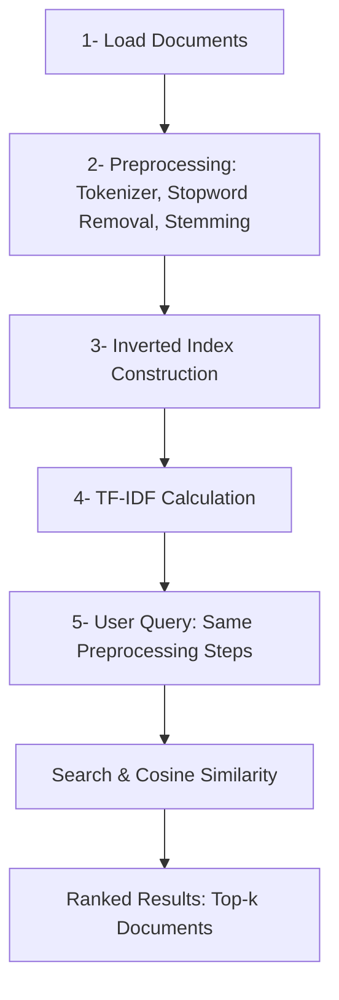

# Information Retrieval System (Vector Model)

A minimal yet powerful Python-based search engine that uses TF-IDF and cosine similarity to retrieve the most relevant documents from a custom corpus.

## Overview

This project implements a simple Information Retrieval (IR) system based on the vector space model, using TF-IDF weighting and cosine similarity for ranking documents. The pipeline includes:

- **Document Collection**
- **Text Preprocessing** (tokenization, stopword removal, stemming)
- **Inverted Index Construction**
- **TF-IDF Computation**
- **Query Processing & Ranking**

By focusing on clarity and modularity, this repository showcases fundamental IR concepts in a way that can be easily extended or integrated into larger systems.

## Key Features

- **Automated Text Preprocessing**
  - Lowercasing, punctuation removal, stopword filtering, and stemming/lemmatization (configurable).
- **Inverted Index**
  - Efficient dictionary structure to map terms to the documents in which they appear, along with their frequencies.
- **TF-IDF Calculation**
  - Dynamic weighting of terms based on their importance within each document and across the entire corpus.
- **Cosine Similarity Ranking**
  - Returns the top-k most relevant documents for any textual query, illustrating the core principle of the vector space model.
- **Extensible Architecture**
  - Easy to plug in different tokenizers, stemmers, or ranking algorithms.

## Workflow Diagram



- **Load Documents**: Reads text files from a specified directory.
- **Preprocessing**: Converts to lowercase, removes punctuation, removes stopwords, and optionally stems words.
- **Inverted Index**: Builds a dictionary where each term is mapped to the documents in which it appears, along with the term frequency.
- **TF-IDF Computation**: Calculates TF-IDF scores for each term in each document.
- **User Query**: Applies the same preprocessing steps.
- **Search & Cosine Similarity**: Compares query TF-IDF vector with each document’s TF-IDF vector using cosine similarity.
- **Ranked Results**: Returns the most relevant documents in descending order of relevance.

## Project Structure

```
.
├── documents/                   # Folder containing .txt documents
├── main.py                      # Main Python script with the IR pipeline
├── README.md                    # This README
└── requirements.txt (optional)  # Python dependencies
```

- **documents/**: Place your 100 text files here (or more/less if needed).
- **main.py**: Contains the functions for:
  - Loading documents
  - Preprocessing
  - Inverted index creation
  - TF-IDF calculation
  - Query handling + ranking

## Prerequisites

- Python 3.7+ (or higher)
- `nltk` for text processing
- (Optional) `numpy`, `scikit-learn`, or other libraries if you plan to extend functionalities.

Make sure you have installed nltk data (especially stopwords):

```bash
python3 -m pip install nltk
python3 -c "import nltk; nltk.download('stopwords')"
```

## Installation & Setup

1. Clone this repository
   ```bash
   git clone https://github.com/your-username/your-repo.git
   cd your-repo
   ```
2. (Optional) Create and activate a virtual environment
   ```bash
   python3 -m venv venv
   source venv/bin/activate   # Mac/Linux
   # or
   venv\Scripts\activate    # Windows
   ```
3. Install the required packages
   ```bash
   pip install nltk
   ```
   If you have a `requirements.txt`, then:
   ```bash
   pip install -r requirements.txt
   ```
4. Ensure NLTK stopwords are downloaded:
   ```bash
   python3 -c "import nltk; nltk.download('stopwords')"
   ```
5. Add your `.txt` files
   Place your 100 text documents in the `documents/` folder.

## Usage

From the project root folder, run:

```bash
python3 main.py
```

You will be prompted to enter a search query in the console:

```bash
Entrez votre requête (ou tapez 'exit' pour quitter) : machine learning
```

The system will then display the top-k results (document IDs) and their cosine similarity scores:

```bash
Résultats pour la requête : 'machine learning'
#1 | Document ID: 12 | Score: 0.4587
#2 | Document ID: 4  | Score: 0.3412
#3 | Document ID: 19 | Score: 0.2975
... 
```

Use `exit` to terminate the program.

## Example Code Snippet

```python
from nltk.corpus import stopwords
from nltk.stem import PorterStemmer
import math

def preprocess_text(text):
    text = text.lower()
    # ... remove punctuation, etc.
    tokens = text.split()
    stop_words = stopwords.words('english')
    stemmer = PorterStemmer()
    tokens = [stemmer.stem(t) for t in tokens if t not in stop_words]
    return tokens

# More code inside main.py ...
```

## Future Enhancements

1. **UI / Frontend**: Create a simple web or GUI interface for entering queries and viewing results.
2. **Lemmatisation / Advanced NLP**: Replace stemming with lemmatisation or integrate advanced NLP libraries like SpaCy for better linguistic accuracy.
3. **Additional Ranking Algorithms**: Experiment with alternative weighting schemes (Okapi BM25, etc.) or incorporate semantic search with word embeddings.
4. **Parallel Processing**: For larger corpora, consider multiprocessing or distributed indexing approaches.
5. **Deployment**: Package the system into a Docker container or deploy it on a cloud service (AWS, GCP, etc.).

## Why This Project Is Exciting for Recruiters

- **Showcases Core IR Concepts**: Demonstrates knowledge of how search engines and ranking algorithms work under the hood.
- **Clean and Modular Code**: Follows a logical structure that can be extended to real-world applications.
- **Practical NLP Skills**: Highlights experience with text preprocessing, tokenization, stopwords, and TF-IDF.
- **Scalability Potential**: A good starting point for building more advanced systems (BM25, BERT-based retrieval, etc.).


## License

This project is licensed under the MIT License. You’re free to use, modify, and distribute this code for personal or commercial purposes.
